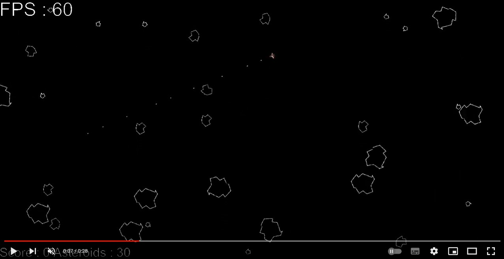

# Captain Asteroid

A minimalist 2D video game directly inspired by [Atari Asteroids](https://www.youtube.com/watch?v=WYSupJ5r2zo) (1978), and created in a week using Unity and its C++ plugin framework. 

**You are Captain Asteroid, destroy all asteroids in the Universe to complete the mission!**

## Demo on Youtube
[](https://www.youtube.com/watch?v=u3iGnAMILYUy "Video on Youtube")

## The Coding Challenge

To make it more challenging, this project had specific constraints that had to be respected:
- Use Unity **only for the rendering part**, the physics engine must be on the C++ plugin side
- Design the application with a focus on optimization, the whole pipeline (simulation + render) must take less than **16.6ms** (60 FPS)
- Implement the physics engine using a **[data-oriented design](https://en.wikipedia.org/wiki/Data-oriented_design)** (DOD) to optimize memory access and performance
- Finish the whole project **in less than a week**

It was a very interesting week and it gave me the chance to learn a ton in a restricted amount of time, given the facts that :
- I had never used Unity
- I had never implemented a DOD pipeline
- I had never programmed in C#
  
## The Results

- [x] Unity handles the UI and the rendering only, C++ plugin does all the physics processing
- [x] Application is fast, about 3-4 ms for the whole process (simulation + render) for a typical game situation (around 50 entities), up to 6-7 ms with more than 100 asteroids in an overcrowded and perilous universe, but then the game session is usually very short... (CPU: Intel i7-9750H, GPU: NVIDIA GTX1650)
- [x] Physics engine is entirely based on a DOD/ECS pipeline
- [x] Done in 5 days

## Commands
| Key   |      Function      |
|----------|:-------------:|
| Left/Right |  Rotate Left / Right |
| Up/Down | Thrust / Brake |
| Space | Fire Laser |


## I just want to play the game (and destroy some asteroids)
Download the Exe folder and launch CaptainAsteroid.exe. Have fun!

## I want to open the Unity project and tweak it
Download or `git clone` the whole repo and open it through Unity Hub. Open the Asteroids Scene in Scene folder if not done already. You can modify the initial number of asteroids of each size (XXL, M, S), from 0 to 200. 

## I want to build the C++ plugin (advanced)

### Requirements

- [Gitbash](https://git-scm.com/downloads)
- [Python](https://www.python.org/) (>= 3.5) and [pip](https://pypi.org/project/pip/)
- [Conan](https://conan.io/)
- [CMake](https://cmake.org/download/)
- C++ compiler, tested with [MSVC 15/19](https://visualstudio.microsoft.com/vs/features/cplusplus/) only for now 

### Setup Conan

```bash
pip install conan
conan remote add conan-center https://conan.io/center/
```
### Build the C++ Plugin

```bash
git clone https://github.com/axoloto/CaptainAsteroid.git
cd CaptainAsteroid
./buildPlugin.sh
```

## Some technical details and design thinking

### Build system and third-party libraries handling
I used CMake to handle the build of the C++ shared library (.dll) and send it automatically to the Unity Plugin folder. It allowed me to increase the developement cycle speed and facilitate the testing. Unfortunately, I quickly realized that, once loaded plugins are never unloaded from Unity, so despite the automation of most of the build pipeline, I still had to close and relaunch Unity software everytime a change was made on C++ side. 

In C++, third-party libraries management has been a potential nightmare for a long time, but things have changed recently thanks to open-source package managers like Conan. Conan gives us the chance to download up-to-date third-party libraries and plug them into our applications very easily. Even better, it is fully integrated into CMake framework, so we can retrieve those third-party libraries as any other packages with `find_package()`.

### C++ DOD physics pipeline
In the past years, I have been focused on GPUs programming so I was familiar with the concept of data-focused pipeline and the gain that we can have in terms of performance. Nevertheless I never heard before of Data-Oriented Design and it was a very nice discovery. After some investigation and testing, I decided to base my physics engine on the awesome [Alec Thomas's entityx](https://github.com/alecthomas/entityx) generic Entity Component System (ECS) library retrieved with Conan. 

Following DOD/ECS concepts, the physics engine is made of :
- Entities, the game entities (Space ship, asteroids, laser shots) made of aggregated components
- Components, entities property (life, laser, position..)
- Systems, pipeline nodes modifying components

At first, it was a bit challenging to forget my OOP instinct, but I quickly saw the potential of the ECS/DOD design and the performance that I could get from it. Implementing the data pipeline was a very enjoyable experience, scaling it up by iteratively adding new features was easier than what I expected.

### Marshaling data from C++ to C# and Game Objects pooling
Having never programmed in C#, I was not aware of the marshaling process and how to connect managed memory (C#) and unmanaged one (C++). I decided to keep it simple and try to avoid any unnecessary and costly allocation/copy at each time iteration, on managed side or unmanage one.

Hence the buffers containing coordinates of the different game NPC entities are allocated once as global variables on managed side, with a fixed size. Then, at each time step, I simply send their addresses on C++ side to fill them, asking C# side to pin the memory buffer during the filling operation. The C++ plugin fills the given buffers up to the number of existing entities and inform C# script how much of the buffer has been filled.

These coordinates buffers are then used to update the positions of the game objects on C# side. Present in different pools, those games objects have all been have generated a single time at the initialization step. All game objects in the pools with an index higher than the number of existing entities at this time step are deactivated for this iteration. By doing so, there is no generation of any game objects at each time iteration.

Pros:
- Simple and very fast
- No game object generation after initialization
- No buffer allocation after initialization
- Fast transfer between C# and C++
- Buffers are allocated on managed side, no potential memory leaks

Cons:
- Simplistic approach, buffers and pools have a fixed size so I am limiting the number of potential game entities to a certain bound. I set it to 200 for each entity type, knowing very well that the game is not playable past 100 asteroids, so this is a reasonable tradeoff and this maximum limit could be definitely lowered.
- There is no ID mapping between game objects on C# side and entities on C++ side. Unity doesn't know which asteroid has been destroyed or not. If I want to add some explosions in the game, I will need to create a new type of game objects and send their coordinates as any other type of entities. 

### C# scripts implementation

Again, having zero experience with C#, I might have missed some good practices and I apologize for any disturbing design in the C# scripts.

I decided to create a Plugin Controller script to do the connection with the native C++ side. By doing so, I can call the API functions from different C# scripts connected to various Game Objects (Space Ship, pools, UI...).

## Next Steps
- [ ] Realizing performance profiling of both CS and CPP sides
- [ ] Adding some unit tests
- [ ] Adding some enemy space ships
- [ ] Improving the bouncing algorithm (collision between asteroids) and collision handling
- [ ] Adding some multithreading to run the C++ plugin on its own thread. Given the current performance, I judged that it was not necessary for the moment
- [ ] Adding some explosions and sounds

## References and Inspirations

- [CMake](https://cmake.org/)
- [Conan](https://conan.io/), an awesome open source package manager for C/C++
- [Entityx](https://github.com/alecthomas/entityx), a fast and efficient open source library implementing generic DOD framework
- [Triangulum](https://github.com/TransNeptunianStudios/Triangulum), another space shooter using Entityx framework, less asteroid-focused and with enemies
- [spdlog](https://github.com/gabime/spdlog), an open source logging library
- [Unity Talk about DOTS by Mike Geig](https://www.youtube.com/watch?v=BNMrevfB6Q0&list=PLX2vGYjWbI0S1wHRTyDiPtKLEPTWFi4cd&index=1), a very clear explanation about DOD/ECS and Unity's own implementation named Data-Oriented Technology Stack (DOTS)
- [Making Space Invaders with Unity](https://www.youtube.com/watch?v=cnfwNzpoIlA), a nice introduction to understand Unity framework and UI implementation
